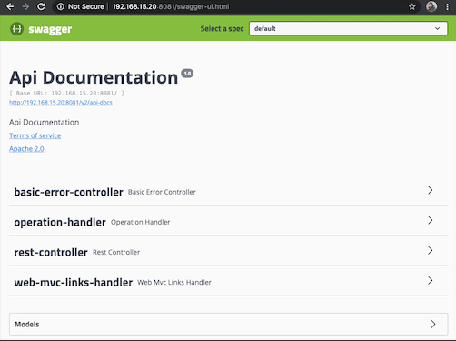

# FII Tax Calculator


Microservice to calculate the taxes from [FII](http://www.b3.com.br/en_us/products-and-services/trading/equities/real-estate-investment-funds-fii.htm) sales in Brazil. 
This application is able to perform calculations with regards to taxes and 
profit from a FII transaction in the [B3](http://www.b3.com.br/en_us/)
.

This microservice is up and running in [here](http://jaimedantas.com/b3).

###### Tecnologies:
* Spring Boot 2.2.2
* Swagger 2
* JUnit 

## Documentation:
You can browser through the Swagger documentation for this API in the link below.

`http://jaimedantas.com/fii`


## Build:
```
mvn clean install
```

## Run:
```
java -jar fii-tax-calculator-0.0.1-SNAPSHOT.jar
```
## Usege

This microservice will run on port 8081 by default.
To access the swagger interface, go to:
```
http://localhost:8081/swagger-ui.html
```



